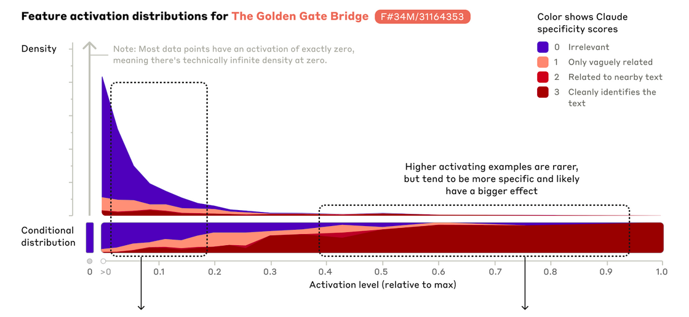

## TODOs
1. what other concepts could I use?
https://claude.ai/share/0eed63b0-93cb-4597-96ee-de2aa5e71eff
*I think I got the important ones*
2. how to use the SAE training evaluation metrics? 
    * just report them?
    * or try to find correlation between interpretability
3. LLM interpretation of features
    * I cannot do all features, it's too expensive. Maybe do the highest activating few from each layer?
4. Learn what graphs I can draw from the data I collected, draw them

## Scaling monosemanticity
* In this work, we focused on applying SAEs to residual stream activations halfway through the model (i.e. at the “middle layer”). We made this choice for several reasons. First, the residual stream is smaller than the MLP layer, making SAE training and inference computationally cheaper. Second, focusing on the residual stream in theory helps us mitigate an issue we call “cross-layer superposition” (see Limitations for more discussion). We chose to focus on the middle layer of the model because we reasoned that it is likely to contain interesting, abstract features (see e.g.,
[11, 12, 13]
).

We trained three SAEs of varying sizes: 1,048,576 (~1M), 4,194,304 (~4M), and 33,554,432 (~34M) features. The number of training steps for the 34M feature run was selected using a scaling laws analysis to minimize the training loss given a fixed compute budget (see below). We used an L1 coefficient of 5 3 . We performed a sweep over a narrow range of learning rates (suggested by the scaling laws analysis) and chose the value that gave the lowest loss.

For all three SAEs, the average number of features active (i.e. with nonzero activations) on a given token was fewer than 300, and the SAE reconstruction explained at least 65% of the variance of the model activations. At the end of training, we defined “dead” features as those which were not active over a sample of 107107 tokens. The proportion of dead features was roughly 2% for the 1M SAE, 35% for the 4M SAE, and 65% for the 34M SAE. We expect that improvements to the training procedure may be able to reduce the number of dead features in future experiments.
Scaling Laws

Training SAEs on larger models is computationally intensive. It is important to understand (1) the extent to which additional compute improves dictionary learning results, and (2) how that compute should be allocated to obtain the highest-quality dictionary possible for a given computational budget.

Though we lack a gold-standard method of assessing the quality of a dictionary learning run, we have found that the loss function we use during training – a weighted combination of reconstruction mean-squared error (MSE) and an L1 penalty on feature activations – is a useful proxy, conditioned on a reasonable choice of the L1 coefficient. That is, we have found that dictionaries with low loss values (using an L1 coefficient of 5) tend to produce interpretable features and to improve other metrics of interest (the L0 norm, and the number of dead or otherwise degenerate features). Of course, this is an imperfect metric, and we have little confidence that it is optimal. It may well be the case that other L1 coefficients (or other objective functions altogether) would be better proxies to optimize.

With this proxy, we can treat dictionary learning as a standard machine learning problem, to which we can apply the “scaling laws” framework for hyperparameter optimization (see e.g. 
[14, 15]
). In an SAE, compute usage primarily depends on two key hyperparameters: the number of features being learned, and the number of steps used to train the autoencoder (which maps linearly to the amount of data used, as we train the SAE for only one epoch). The compute cost scales with the product of these parameters if the input dimension and other hyperparameters are held constant.

We conducted a thorough sweep over these parameters, fixing the values of other hyperparameters (learning rate, batch size, optimization protocol, etc.). We were also interested in tracking the compute-optimal values of the loss function and parameters of interest; that is, the lowest loss that can be achieved using a given compute budget, and the number of training steps and features that achieve this minimum.

We make the following observations:

Over the ranges we tested, given the compute-optimal choice of training steps and number of features, loss decreases approximately according to a power law with respect to compute.

As the compute budget increases, the optimal allocations of FLOPS to training steps and number of features both scale approximately as power laws. In general, the optimal number of features appears to scale somewhat more quickly than the optimal number of training steps at the compute budgets we tested, though this trend may change at higher compute budgets.

These analyses used a fixed learning rate. For different compute budgets, we subsequently swept over learning rates at different optimal parameter settings according to the plots above. The inferred optimal learning rates decreased approximately as a power law as a function of compute budget, and we extrapolated this trend to choose learning rates for the larger runs.

## automatic interpretation
1. check how 'towards monosemanticity' does it
2. check how interplm does it -> no code for it
From paper: LLM feature annotation pipeline
Example selection. An analysis was performed on a random selection
of 1,240 (10%) features. For each feature, representative proteins were
selected by scanning 50,000 Swiss-Prot proteins to find those with maxi-
mum activation levels in distinct ranges. Activation levels were quantized
into bins of 0.1 (0–0.1, 0.1–0.2, …, 0.9–1.0), with two proteins selected
per bin that achieved their peak activation in that range, except for the
highest bin (0.9–1.0), which received ten proteins. Moreover, ten random
proteins with zero activation were included to provide negative examples.
For features where fewer than 20 proteins reached peak activation in the
highest range (0.9–1.0), additional examples were sampled from the
second-highest range (0.8–0.9) to achieve a total of 24 proteins between
these two bins, split evenly between training and evaluation sets. Features
were excluded if fewer than 20 proteins could be found reaching peak
activation across the top three activation ranges combined.
Description generation and validation. For each feature, we compiled
a table containing protein metadata, quantized maximum activation
values, indices of activated amino acids and amino acid identities at
these positions. Using this data, we prompted Claude-3.5 Sonnet (new)
to generate both a detailed description of the feature and a one-sentence
summary that could guide activation level prediction for new proteins.
To validate these descriptions, we provided Claude with an inde-
pendent set of proteins (matched for size and activation distribution)
along with their metadata but without activation information. Claude’s
predicted activation levels were compared with measured values using
Pearson correlation.
3. check if evo2 does it, if yes how -> they manually annotate features, from known concept regions
4. make an implementation plan
5. implement

## feature-neuron correlation
is a given feature doing the same work as some neuron?

## interpretability of neurons vs features
are neurons more, less, equally interpretable as features?